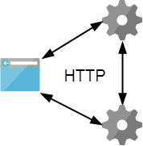

# Паттерны RESTful API

---
## Введение



Веб-сервисы общаются  друг с другом и со сторонними приложениями посредством сообщений,  
основанных на определённых протоколах (SOAP, XML-RPC, ...) и соглашениях (REST).

<!-- 
Чтобы объяснить что такое REST, начну изделека. 

Допустим хотип построить большую сложную ИС.
Для простоты делим на компомненты. 
Компоненты должны как-то общаться между собой.
С легкой руки архитектора решено реализовать эти компоненты в виде сервисов, и назвать это SOA.
А более конкретно веб-сервисов, и организовать общение между ними по протоколу HTTP.
Нельзя просто держать открытый через сокет и писать в него любую двоичную билиберду, как, например, RMI или веб-сокеты.
Общение по принципу запрос-ответ с четкой структурой, понятно когда открывать-закрывать сокет. 

Исходная точка обсуждения.
Хотя HTTP имеет четкую структуру, в его полях мы можем послать любую белиберду.
Как конкретно строить взаимодействие между сервисами поверх HTTP?
С одной стороны, на него отвечают протоколы прикладного уровня JSON/XML-RPC, SOAP. 
С другой, архитектура REST. 
-->

---
## JSON-RPC
Единственный URL, принимает POST запросы вида:
```
{
  "jsonrpc": "2.0", 
  "method": "post.like", 
  "params": { "post": "12345" }
}
```
Отдает ответы вида:
```
{
  "jsonrpc": "2.0", 
  "result": { "likes": 123 }, 
}
```
```
{
  "jsonrpc": "2.0", 
  "error": {"code": 666, "message": "Post not found"}
}
```

<!-- 
Remote Procedure Call
Впервые опубликован в 2009 году.
Протокол удалённого вызова процедур, использующий JSON для кодирования сообщений. 
www.jsonrpc.org/specification
www.simple-is-better.org/json-rpc/transport_http.html 
-->

---
## XML-RPC
Запрос:
```
<methodCall>
   <methodName>examples.getStateName</methodName>
   <params>
      <param>
         <value><i4>41</i4></value>
      </param>
   </params>
</methodCall>
```
Ответ:
```
<methodResponse>
   <params>
      <param>
         <value><string>South Dakota</string></value>
      </param>
   </params>
</methodResponse>
```
<!-- 
Впервые опубликован в 1999 году.
Для кодирования сообщений используется XML.
-->

---
## SOAP
```
GET /Reservations?code=FT35ZBQ 
```
```
POST /Reservations 
Content-Type: application/soap+xml; charset="utf-8"

<env:Envelope xmlns:env="...">
 <env:Header>
   <t:transaction xmlns:t="...">5</t:transaction>
 </env:Header>  
 <env:Body>
   <m:chargeReservation xmlns:m="...">
     <m:reservation xmlns:m="...">
       <m:code>FT35ZBQ</m:code>
     </m:reservation>
     <o:creditCard xmlns:o="...">
       <n:name xmlns:n="...">Åke Jógvan Øyvind</n:name>
     <o:number>123456789099999</o:number>
    </o:creditCard>
   </m:chargeReservation
  </env:Body>
</env:Envelope>
```
<!--
Simple Object Access Protocol 
Наследник XML-RPC, сообщения кодируются в XML.

Сервисы имеют описание на языке WSDL, которое тоже является XML. 
WSDL позволяет клиентам автоматически сгенерировать классы для построения запросов.

Поддерживается как метод GET так и POST. 
GET только для получения данных. 
POST можно использовать для всех случаев. 
На практике обычно используется только POST.

Главным недостатком SOAP является его сложность по причине гибкости. 
Другой немало важным недостатком является поддержка кодирования только в XML.
-->
